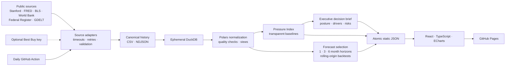

# MemoryPulse

MemoryPulse is a continuously updated, open-source market-intelligence project that tracks public
signals around AI infrastructure demand, HBM allocation, DRAM supply, semiconductor conditions,
and consumer memory prices. It preserves historical facts, builds an ephemeral analytical database,
publishes a transparent 0–100 Memory Pressure Index, produces an auditable business conclusion on
every validated run, withholds forecasts until the history is sufficient, and serves an interactive
React decision-support site through GitHub Pages.

It is designed to operate for **$0**: no continuously running server, paid database, paid API, API-key
requirement, or paid LLM. Its language describes association and market context—not unsupported
causality.

> **Disclaimer:** MemoryPulse is an independent research project. Its Memory Pressure Index and
> forecasts are analytical estimates, not official industry benchmarks, investment advice,
> purchasing advice, or guarantees of future prices.

## Research question and significance

How do public memory-price observations, semiconductor macro indicators, manufacturer events, and
AI/HBM allocation signals move together over time—and what might those associations mean for
consumer memory-price exposure?

Memory is a small but strategically important part of many device bills of materials. MemoryPulse
makes fragmented public signals easier to inspect while keeping source definitions, confidence,
missingness, and uncertainty visible.

## Architecture



The committed CSV and NDJSON files are canonical. DuckDB is recreated inside a temporary directory
for every run and is never committed. The browser reads only generated static JSON.

## Technology

- React 19, TypeScript strict mode, Vite, a dependency-free hash router, Apache ECharts
- Python 3.12, Polars, DuckDB, PyArrow, Requests, Beautiful Soup, Statsmodels, NumPy
- Pytest, Ruff, ESLint, TypeScript checks, Vitest
- GitHub Actions and GitHub Pages

## Public sources

| Source | Role | Authentication | Default behavior |
|---|---|---:|---|
| [Stanford Memory Price Data](https://dam.stanford.edu/assets/memory-prices/memory-prices.csv) | Historical/monthly price context, including source attribution | None | Enabled |
| [FRED PCU3344133441](https://fred.stlouisfed.org/series/PCU3344133441) | Broad semiconductor producer-price context | None | Enabled |
| [BLS Public Data API](https://www.bls.gov/developers/home.htm) | U.S. semiconductor manufacturing employment | None | Enabled |
| [World Bank Indicators API](https://api.worldbank.org/v2/country/WLD/indicator/TX.VAL.TECH.CD?format=json) | Global high-technology export context | None | Enabled |
| [Federal Register API](https://www.federalregister.gov/developers/documentation/api/v1) | Official semiconductor policy and rule metadata | None | Enabled |
| [GDELT DOC API](https://blog.gdeltproject.org/gdelt-doc-2-0-api-debuts/) | Article metadata and short excerpts | None | Enabled; failures are non-blocking |
| [DRAMeXchange homepage](https://www.dramexchange.com/) | Public homepage spot/module tables only | None | Disabled pending owner terms/robots review |
| [Best Buy Products API](https://bestbuyapis.github.io/api-documentation/) | Optional retail module observations | Optional key | Disabled automatically without a key |

See [DATA_SOURCES.md](DATA_SOURCES.md) for collection, caveat, redistribution, and failure details.

## Local setup

Use Python 3.12 and Node.js 22 (Node 20 or newer is supported by the selected frontend tooling).

```bash
python3.12 -m venv .venv
source .venv/bin/activate
python -m pip install -e ".[dev]"
cd frontend
npm ci
cd ..
make bootstrap
make verify
```

To start the site locally:

```bash
make frontend
```

Vite prints the local URL. The checked-in `frontend/public/data/` files contain the last validated
production export.

Make and the helper scripts automatically prefer the repository's `.venv` and add `pipeline/src` to
the Python import path. This prevents an unrelated shell or desktop-app Python setting from causing
`ModuleNotFoundError: memorypulse` during test collection.

### Windows PowerShell

```powershell
py -3.12 -m venv .venv
.venv\Scripts\Activate.ps1
python -m pip install -e ".[dev]"
npm ci --prefix frontend
python -m memorypulse.cli export --production
python -m pytest
npm run lint --prefix frontend
npm run typecheck --prefix frontend
npm run test:run --prefix frontend
npm run build --prefix frontend
```

The Bash helper scripts are conveniences; every operation is available through Python and npm.

## Data operations

### Safe offline pipeline

```bash
python -m memorypulse.cli update --offline --output-root build/offline
python -m memorypulse.cli validate --root build/offline
```

Offline mode loads clearly marked test fixtures, rebuilds DuckDB, runs transformations, calculates
the index, attempts forecasting, and exports a complete site contract beneath the ignored
`build/offline/` directory. The manifest is forced to `production_data: false`; deployment rejects
fixture publication.

### Production update

```bash
python -m memorypulse.cli update
python -m memorypulse.cli validate
```

The production command calls enabled public sources, appends only new stable IDs, records each source
run, rebuilds DuckDB, generates forecasts no more than weekly, writes a quality report, and replaces
frontend JSON atomically. At least one real core source must succeed. An optional or news-source
failure is disclosed without deleting previous observations.

### Verification

```bash
make verify
```

That command runs Ruff, Pytest (including the offline end-to-end path and React build), a separate
offline export validation, frontend linting, strict type checks, Vitest, the Vite production build,
and generated-file size limits.

Other targets: `make install`, `make bootstrap`, `make update`, `make validate`, `make frontend`,
`make test`, `make build`, and `make compact` (an ignored Zstandard Parquet analytical export).

## Memory Pressure Index

The analytical index combines available components using versioned weights:

- Spot-price momentum: 30%
- Retail-price momentum: 25%
- Price volatility: 15%
- News pressure: 15%
- Semiconductor macro pressure: 15%

Each component is normalized against its own trailing distribution using robust 10th–90th
percentiles and clamped to 0–100. Missing components are omitted, remaining weights are renormalized,
and confidence equals the share of configured weight represented. A missing retail feed therefore
reduces confidence instead of silently contributing a neutral score. Status bands are Normal (0–24),
Moderate Pressure (25–49), Elevated Pressure (50–74), and Severe Pressure (75–100).

The index is an independent analytical indicator, not an official benchmark or certain shortage
predictor. Full formulas are in [METHODOLOGY.md](METHODOLOGY.md).

## Business analytics and interactive decisions

Each successful run publishes a versioned executive brief with a pressure regime, market direction,
confidence, procurement and inventory posture, budget-risk label, top explainable drivers, known risks,
and a plain-language conclusion. Briefs are also appended to `data/history/decision_briefs.csv`, so the
website can show how conclusions changed over time instead of replacing the prior interpretation.

The Analytics workspace separates incompatible official indicators, exposes each index component's
effective weight and contribution, compares forecast candidates, and states whether the data volume is
ready for baseline models or more advanced ML. Advanced multivariate ML remains disabled until at least
60 comparable monthly DDR5 observations exist; the site reports the remaining evidence gap.

Interactive tools include DDR-generation/source/date-range filters, per-series visibility controls,
shareable price views, CSV downloads, event search/sort/export, forecast-horizon selection, device-cost
scenarios, and a procurement lab that compares modeled price movement with inventory carrying cost.

## Forecasting

A series needs at least 12 genuine comparable observations. MemoryPulse evaluates naive last value,
drift, three-period rolling mean, and damped Holt trend with rolling-origin backtests. The model with
the lowest MAE is selected while MAPE is reported only when actual values are nonzero. Forecasts are
published at 1-, 3-, and 6-month horizons; uncertainty expands with horizon using backtest residual
variability. Forecast vintages remain in history for later accuracy checks.
No synthetic history is generated, and insufficient series show: **“Collecting additional history
before publishing a forecast.”**

## Data-quality and growth controls

- Stable SHA-256-derived observation IDs and append-before-deduplicate history updates
- Positive-price, future-date, contract, fixture-publication, and JSON-finiteness checks
- Sudden changes are flagged in quality output, not silently deleted
- Atomic text and JSON writes preserve the previous complete file on write failure
- A zero-row parse is degraded; a layout explosion is bounded in the public-homepage adapter
- No committed raw HTML, article bodies, API keys, or DuckDB binaries
- Routine news metadata is retained for about 365 days; manually important events can be retained
- Numerical price history is permanent; optional analytical Parquet belongs in `data/exports/`
- Frontend JSON warns/fails above 5 MB per file

For long-term archiving, create a tagged release, move a closed year of detailed compact numerical
history to a year-partitioned Parquet file under an external public archive, retain a checksummed
summary in the repository, and update `DATA_SOURCES.md`. Never remove the compact canonical price
history merely to reduce repository size.

## Scheduled automation

`update-data.yml` runs daily at 10:17 UTC and can be started manually. It uses only a standard GitHub
runner, validates before staging, commits only changed canonical history/exports, never force-pushes,
and uploads a seven-day diagnostic artifact. A failed run makes no commit, so the existing Pages site
remains available. `deploy-pages.yml` separately checks and publishes `frontend/dist`.

## GitHub Pages setup

After pushing this local repository to a **public GitHub repository**:

1. Open **GitHub repository → Settings → Pages**.
2. Under **Build and deployment**, set **Source → GitHub Actions**.
3. Run **Actions → Deploy GitHub Pages → Run workflow**, or push a frontend/data change to `main`.
4. Confirm the published site links back to `https://github.com/Photon7777/memorypulse`.

The Vite base path is derived from `GITHUB_REPOSITORY` during Actions builds; local development uses
`/`. Hash-based navigation keeps direct routes safe beneath the repository subpath.

No local code can change the repository’s Pages source setting.

## Optional Best Buy key

MemoryPulse works fully without this integration. To enable it:

1. Obtain a key under the Best Buy API’s then-current terms; free availability is not guaranteed.
2. For local use, copy `.env.example` to `.env`, set `BESTBUY_API_KEY`, and export/load it into the
   shell before the update. `.env` is ignored.
3. For scheduled updates, open **GitHub repository → Settings → Secrets and variables → Actions →
   New repository secret**, name it `BESTBUY_API_KEY`, and save the value.

The secret is read only by the Python runner. It is never generated into frontend JavaScript or
committed files.

## Limitations

- Public feeds can change format, rate-limit requests, revise history, or disappear.
- DRAMeXchange is intentionally disabled until the owner reviews current robots and terms; its parser
  is covered by a lawful local fixture only.
- FRED’s broad semiconductor index is contextual and is not a direct RAM price.
- Stanford series mix source definitions; HBM estimates remain labeled as estimates.
- Public news metadata measures coverage intensity, not ground truth or causal impact.
- Optional retail coverage can be absent, lowering index confidence.
- A statistical forecast cannot capture every manufacturer, inventory, or demand shock.

## Repository structure

```text
memorypulse/
├── .github/              # CI, daily update, Pages deployment, Dependabot
├── config/               # Source, product, and index configuration
├── data/                 # Canonical history and compact analytical exports
├── frontend/             # React/Vite site and generated public JSON
├── pipeline/             # Python package, adapters, analytics, exporters, tests
├── scripts/              # Bootstrap, update, and verification entry points
├── DATA_SOURCES.md
├── METHODOLOGY.md
├── PROGRESS.md
├── pyproject.toml
└── Makefile
```

## Screenshots

Add captures after the first GitHub Pages deployment:

- `docs/screenshots/overview-desktop.png` — research overview and Pressure Index
- `docs/screenshots/price-trends.png` — interactive source-defined price chart
- `docs/screenshots/impact-explorer-mobile.png` — responsive scenario calculator

## Portfolio copy

**LinkedIn-ready:** Built MemoryPulse, a zero-cost, open-source market-intelligence pipeline and
React research site that continuously monitors public memory pricing, semiconductor macro context,
and explainably tagged news metadata. Designed canonical historical storage, ephemeral DuckDB/Polars
analytics, a confidence-aware market index, rolling-origin statistical forecasts, and failure-safe
GitHub Actions/Pages deployment—with no paid APIs or servers.

**Resume-ready:**

- Engineered a keyless Python data pipeline with source-isolated failures, atomic history updates,
  DuckDB analytical views, Polars normalization, and reproducible static JSON contracts.
- Designed a transparent 0–100 market-pressure indicator with robust normalization, missing-component
  reweighting, confidence scoring, and deterministic evidence-safe insights.
- Implemented rolling-origin model selection across naive, drift, rolling-mean, and Holt baselines,
  preserving forecast vintages and uncertainty intervals for later accuracy evaluation.
- Built an accessible React/TypeScript/ECharts research experience and $0 GitHub Actions/Pages
  workflow that preserves the previous site when scheduled collection fails.

## License and attribution

Code is available under the [MIT License](LICENSE). Upstream observations retain source names and
URLs. Data remains subject to each source’s own terms and redistribution limitations; MemoryPulse
stores normalized facts and metadata, not copyrighted article bodies or downloaded webpages.
